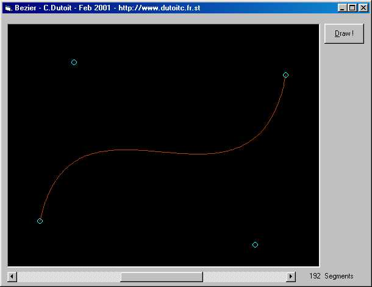



## Bézier curves

### Description

Ever wondered on how to draw Bézier curves ?

well, here is a recursive method that let you move control points and define the depth of recursivity.

Really help to understand how it works, ever if you don't know the theory about it
 
### More Info
 
Bézier curves are use in infographie (3D, ...).

By defining 4 points of control, a bezier curve go from the first point to the last point and betwen by going indirection of intermediate points (see picture, a picture is better than thousand explanations)

             |
---                |---
**Submitted On**   |2001-02-28 23:10:44
**By**             |[C\.Dutoit](https://github.com/Planet-Source-Code/PSCIndex/blob/master/ByAuthor/c-dutoit.md)
**Level**          |Intermediate
**User Rating**    |5.0 (15 globes from 3 users)
**Compatibility**  |VB 5\.0, VB 6\.0
**Category**       |[Complete Applications](https://github.com/Planet-Source-Code/PSCIndex/blob/master/ByCategory/complete-applications__1-27.md)
**World**          |[Visual Basic](https://github.com/Planet-Source-Code/PSCIndex/blob/master/ByWorld/visual-basic.md)
**Archive File**   |[CODE\_UPLOAD156072282001\.zip](https://github.com/Planet-Source-Code/c-dutoit-b-zier-curves__1-21402/archive/master.zip)

